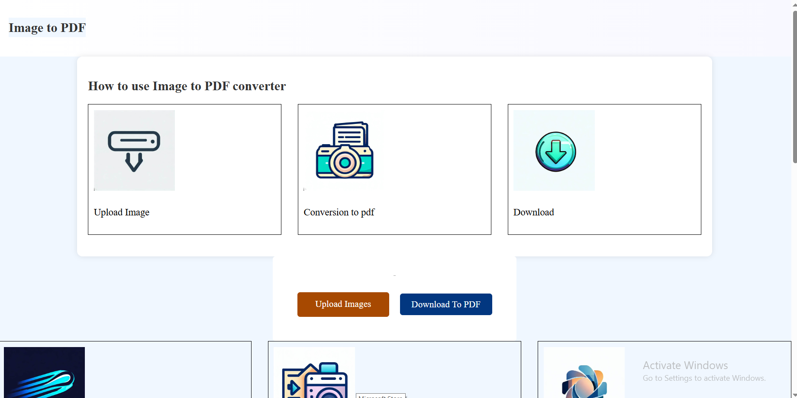

📄 Image to PDF Converter Web Application
This web application provides a simple and user-friendly tool for converting image files into PDF documents. Built with HTML, CSS, and JavaScript, the application allows users to upload multiple images and convert them into a single PDF file with just a few clicks.

📂 Project Structure
The application is organized into three main files:

📌 index.html
Defines the layout and content of the web application.
Includes the image upload interface, informational sections, and contact information.
🎨 styles.css
Contains all styling rules for the application.
Ensures a responsive and visually appealing interface.
Follows a clean blue and white color scheme.
⚡ script.js
Powers the image-to-PDF conversion process.
Handles file uploads, image processing, and PDF generation.
🛠️ Technical Implementation
The application utilizes:

✅ HTML5 → Structural elements & form inputs
✅ CSS3 → Responsive styling & visual design
✅ JavaScript → Handles user interactions & processing
✅ 📄 jsPDF Library (loaded from CDN) → Generates PDF documents
✅ 📂 FileReader API → Handles file uploads
✅ 🖼️ Canvas API → Processes images before PDF generation
